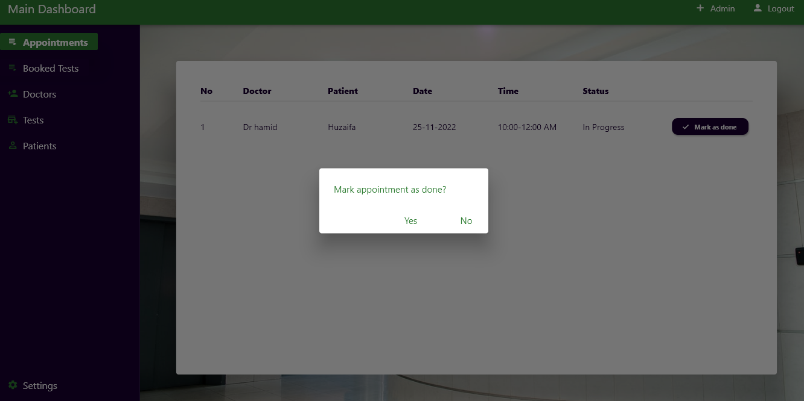

# Appointing
`INTRODUCTION`:
This project is thought in order to minimize the difficuilties faced by patients. Just to get information about 
something or to book an appointment people have to go through a huge load of process work. This system is a 
DESKTOP application and a hybrid MOBILE app with a distinct relational database. 
FLUTTER is used for the hybrid mobile app and the web application. They both have a backend built on SPRING 
Framework with an absolute use of REST APIs connected with MySQL. It will also have Firebase as our realtime 
authenticator. People will be able to scroll different doctors and their specializations, whether or not a 
particular test is available in the hospital, they will even be able to book an appointment/test via app and cancel 
it anytime.

`TOOLS USED`:
1. `Flutter` for Mobile & Desktop app
2. `Java Spring Framework` for RestAPI.
3. `Firebase` for authentication.
4. `MySQL` workbench (for testing).
5. `Postman` for API testing
6. `Heroku` & `PostgreSql` for deployment

`Note`: for Desktop app, MSVSC should be 2019 or below.

